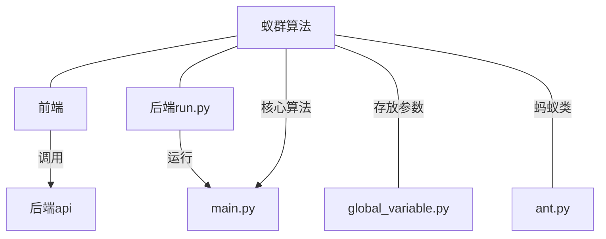

# aco
**蚁群算法**（**A**nt **C**olony **O**ptimization, **ACO**），又称**蚂蚁算法**，是一种用来在图中寻找优化路径的机率型算法。它由 Marco Dorigo 于 1992 年在他的博士论文“[Ant system: optimization by a colony of cooperating agents](http://ieeexplore.ieee.org/xpls/abs_all.jsp?arnumber=484436)”中提出，其灵感来源于蚂蚁在寻找食物过程中发现路径的行为。蚁群算法是一种模拟进化算法，初步的研究表明该算法具有许多优良的性质。针对 PID 控制器参数优化设计问题，将蚁群算法设计的结果与遗传算法设计的结果进行了比较，数值仿真结果表明，蚁群算法具有一种新的模拟进化优化方法的有效性和应用价值。  

